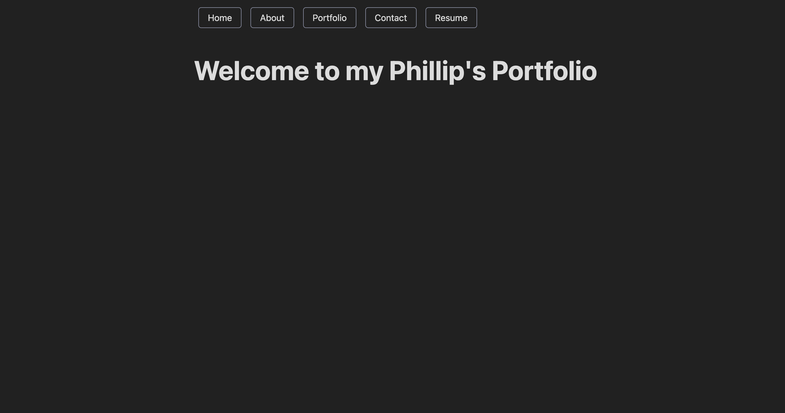
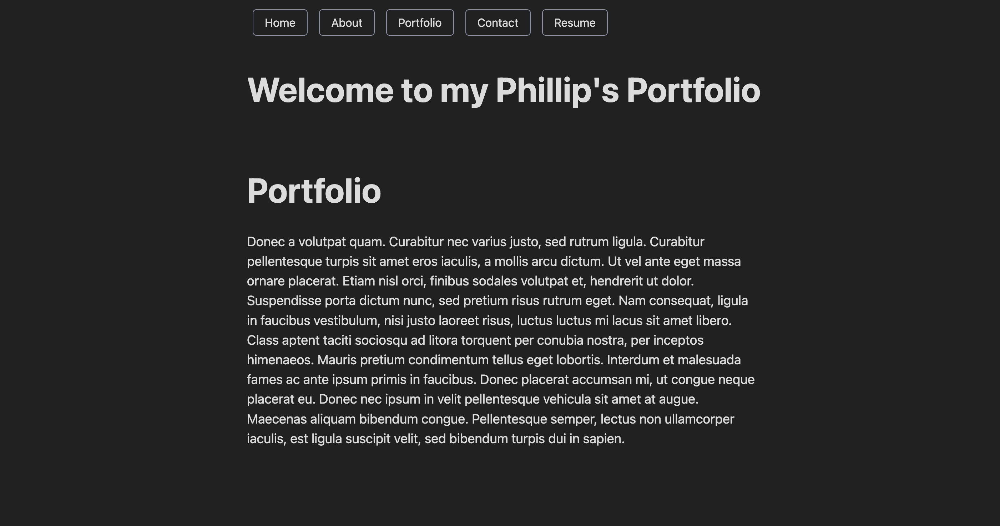
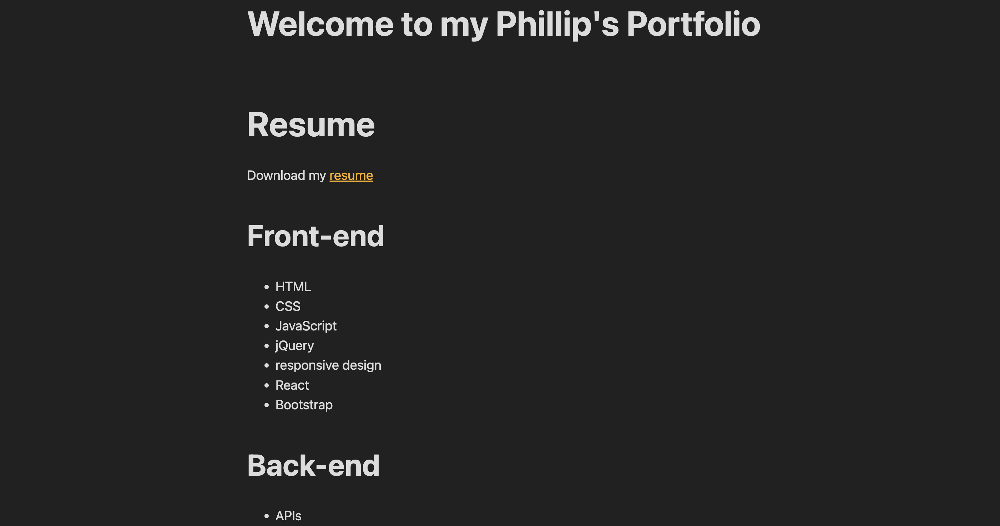

# mongo-net-api

## Description

Mongo Net API, effortlessly integrate social features like sharing thoughts, reacting to friends' posts, and managing friend lists into your app. Streamline development and enhance user engagement. Elevate your app's social experience with Mongo Net API today!

## Table of Contents

- [Installation](#installation)
- [Usage](#usage)
- [Contributing](#contributing)
- [Tests](#tests)
- [Questions](#questions)
- [License](#license)

## Installation

npm run dev

## Usage

Social network

## Contributing

Be kind

## Tests

n/a

## Questions

For questions about the project, please contact [trutechdad](https://github.com/trutechdad) via GitHub or [email](mailto:Phambrown@carolina.rr.com).

## License

This project is licensed under the terms of the [MIT License](https://opensource.org/licenses/MIT).

## Screen Shot

